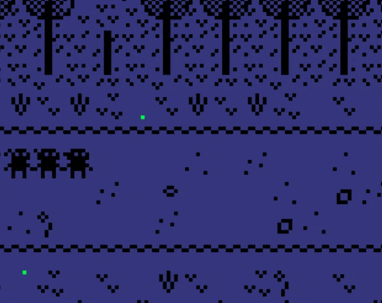

# noctiluca

A [bitsy](https://ledoux.itch.io/bitsy) vignette game about glow worm spotting in Hertfordshire, England. Playable [here](https://deerful.itch.io/noctiluca).

Includes plaintext gamedata and html template, with embedded audio and multi-sprite avatar/ending from dialogue hacks from [bitsy-hacks](https://github.com/seleb/bitsy-hacks). I've also tinkered with the colours of some of the sprites in the game data text, which allows the avatar to be a different colour from the glow worms.

Note that because the game relies on various hacks, it will appear buggy in the original Bitsy editor.